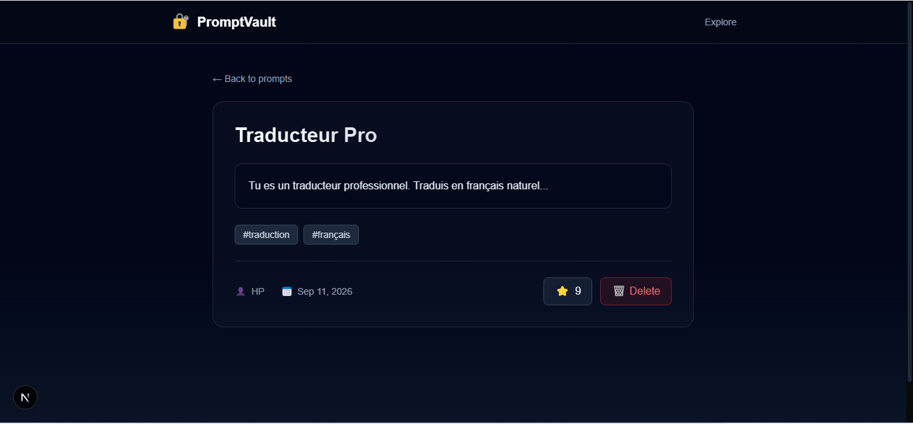

<div align="center">

# 🔐 PromptVault

### The open-source GitHub for AI prompts

[](https://opensource.org/licenses/MIT)
[](http://makeapullrequest.com)
[](https://www.typescriptlang.org/)
[](https://nextjs.org/)
[](https://www.postgresql.org/)

**Store. Version. Share. Discover. — All your AI prompts in one place.**

</div>

---

## 🎯 What is PromptVault?

**PromptVault** is a free, open-source platform to **store, version, share, and discover AI prompts** — for ChatGPT, Claude, Gemini, Midjourney, and more.

Think of it as **GitHub for prompts**.

- 📝 Save your best prompts
- ⭐ Vote on the best ones
- 🏷️ Tag & organize by use case
- 🔍 Search across all prompts
- 💻 Use it via **Web UI** or **REST API**

---

## 📸 Screenshots

### 🏠 Homepage — Discover the best prompts



### 📄 Prompt Detail — View, vote, and delete


---

## ✨ Features

| Feature | Description |
|---------|-------------|
| 🗂️ **Prompt Management** | Create, view, delete prompts |
| ⭐ **Voting System** | Upvote to surface the best prompts |
| 🏷️ **Tags** | Organize by model, use case, language |
| 🔍 **Search** | Full-text search *(coming soon)* |
| 🔐 **Auth** | Login + OAuth *(coming soon)* |
| 💻 **CLI** | `pv push`, `pv pull` *(coming soon)* |
| 🌐 **REST API** | Full API for developers |
| 📦 **Self-hosting** | Docker one-liner |
| 🌙 **Dark Mode** | Because obviously |

---

## 🏗️ Tech Stack

### Frontend
- **[Next.js 16](https://nextjs.org/)** — React framework (App Router)
- **[Tailwind CSS](https://tailwindcss.com/)** — Utility-first styling
- **[TypeScript](https://www.typescriptlang.org/)** — Type safety

### Backend
- **[Hono](https://hono.dev/)** — Ultrafast web framework
- **[Drizzle ORM](https://orm.drizzle.team/)** — Type-safe SQL
- **[PostgreSQL 16](https://www.postgresql.org/)** — Robust database

### DevOps
- **[Docker](https://www.docker.com/)** — Containerization
- **[Turborepo](https://turbo.build/)** — Monorepo build
- **[pnpm](https://pnpm.io/)** — Fast package manager

---

## 📁 Project Structure

```
promptvault/
├── apps/
│   ├── web/         # Next.js frontend
│   ├── api/         # Hono backend
│   └── cli/         # CLI (WIP)
├── packages/
│   ├── shared/      # Shared types
│   ├── ui/          # UI components
│   └── sdk/         # JS SDK
├── docker/          # Docker configs
├── docs/            # Documentation
└── scripts/         # Utilities
```

---

## 🚀 Getting Started

### Prerequisites

- **Node.js** >= 20
- **pnpm** >= 9
- **Docker** (for PostgreSQL)

### 1. Clone

```bash
git clone https://github.com/phamicoene-ai/promptvault.git
cd promptvault
```

### 2. Install

```bash
pnpm install
```

### 3. Start PostgreSQL

```bash
docker run --name promptvault-db ^
  -e POSTGRES_PASSWORD=postgres ^
  -e POSTGRES_DB=promptvault ^
  -p 5432:5432 ^
  -d postgres:16
```

### 4. Setup DB schema

```bash
cd apps/api
pnpm db:push
```

### 5. Launch

**Terminal 1 — API** (port 3001) :
```bash
cd apps/api
pnpm dev
```

**Terminal 2 — Front** (port 3000) :
```bash
cd apps/web
pnpm dev
```

### 6. Open 🌐

👉 **http://localhost:3000**

---

## 🔌 API Endpoints

| Method | Route | Description |
|--------|-------|-------------|
| `GET` | `/api/prompts` | List all prompts |
| `GET` | `/api/prompts/:id` | Get one prompt |
| `POST` | `/api/prompts` | Create a prompt |
| `PUT` | `/api/prompts/:id` | Update a prompt |
| `DELETE` | `/api/prompts/:id` | Delete a prompt |
| `POST` | `/api/prompts/:id/vote` | Vote for a prompt |

### Example

```bash
# List prompts
curl http://localhost:3001/api/prompts

# Create a prompt
curl -X POST http://localhost:3001/api/prompts ^
  -H "Content-Type: application/json" ^
  -d "{\"title\":\"Code Review\",\"content\":\"You are a senior dev...\",\"tags\":[\"code\"]}"
```

---

## 🗺️ Roadmap

### ✅ v0.1 — MVP (DONE)
- [x] Monorepo (Turborepo + pnpm)
- [x] API Hono (8 routes)
- [x] PostgreSQL + Drizzle ORM
- [x] Persistance DB
- [x] Front Next.js 16
- [x] Création de prompts
- [x] Vote ⭐
- [x] Page détail
- [x] Design dark polish

### 🚧 v0.2 — Community (IN PROGRESS)
- [ ] Auth (email + GitHub OAuth)
- [ ] Modification de prompts
- [ ] Recherche par tags
- [ ] Profils utilisateurs
- [ ] Commentaires

### 🔮 v0.3 — Power Users
- [ ] CLI tool (`pv`)
- [ ] JS SDK
- [ ] Import depuis ChatGPT/Claude

### 🌟 v1.0 — Stable
- [ ] Déploiement cloud (Vercel + Railway)
- [ ] Mobile app
- [ ] Marketplace

---

## 🤝 Contributing

Contributions welcome!

1. Fork the repo
2. Create branch (`git checkout -b feature/amazing`)
3. Commit (`git commit -m 'feat: add amazing'`)
4. Push (`git push origin feature/amazing`)
5. Open a Pull Request

---

## 📜 License

MIT © [PromptVault Contributors](LICENSE)

---

<div align="center">

**Made with ❤️ by the community.**

[⬆ Back to top](#-promptvault)

</div>